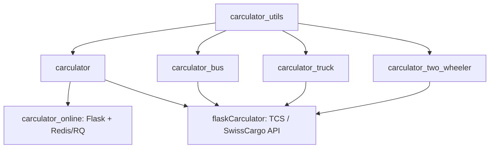

# Carculator family revival audit

Implementation roadmap: [Robustness and installation plan](ROBUSTNESS_PLAN.md).

Audit date: 2026-10-06. Scope: the five core libraries, the existing passenger-car
web application, and the Flask API. This pass updates source checkouts and agent
guidance; it does not attempt a scientific recalibration or implement the defects
identified below.

## Repository state

The GitHub organization inventory confirmed the five core libraries and
flaskCarculator. Existing romainsacchi remotes were retained; several now redirect
to Laboratory-for-Energy-Systems-Analysis. All seven origins were fetched.

| Repository | Branch inspected | Starting HEAD | Audited HEAD | Role |
| --- | --- | --- | --- | --- |
| carculator | master | c33d699 | 67361c8 | Passenger cars/light-duty vehicles |
| carculator_utils | master | b3c1170 | e431f50 | Shared numerical, inventory, background, export infrastructure |
| carculator_bus | master | f0179e9 | 24b1288 | City/coach buses and charging strategies |
| carculator_truck | master | fff196e | fff196e | Freight vehicles, payload/range sizing, ownership costs |
| carculator_two_wheeler | main | 5ba0c0b | 52c2157 | Bicycles, scooters, mopeds, motorcycles |
| carculator_online | master | b2490657 | a4344397 | Flask/RQ passenger-car website |
| flaskCarculator | TCS | ab04879 | ab04879 | Multi-vehicle API, TCS/SwissCargo translation |

Safe updates were fast-forwarded. Truck was already current. Local notebooks,
workbooks, and IDE edits were preserved. Nothing was committed or pushed.

Two Git exceptions remain intentionally unresolved:

- Utils tag `v.1.3.3` differs: local `0e3514cfc516b4461c9047b16a7491447d6119ae`,
  remote `30694750d6cce8b741062746a0d906f076659031`. The initial tagged fetch was
  rejected; a subsequent `git fetch origin --no-tags` updated branch references,
  and master was fast-forwarded. The local tag was not overwritten.
- API local TCS `ab04879` and remote TCS `8ff3142` each have one distinct commit,
  but `git diff HEAD origin/TCS` is empty. No reset/rebase/merge commit was made.
  Remote main (`c22ae5a`) was inspected separately: it contains AI commentary,
  extraction, and SwissCargo cost work and uses unpinned Git dependencies. It is
  not interchangeable with the TCS branch's pinned application contract.

AGENTS.md was created for bus, truck, two-wheeler, and online, and updated for
carculator, utils, and the API. Existing guidance was retained where accurate;
obsolete car module paths and API factory/test claims were corrected.

Guidance index: [cars](../AGENTS.md),
[utils](../../carculator_utils/AGENTS.md),
[buses](../../carculator_bus/AGENTS.md),
[trucks](../../carculator_truck/AGENTS.md),
[two-wheelers](../../carculator_two_wheeler/AGENTS.md),
[online](../../carculator_online/AGENTS.md),
[API](../../flaskCarculator/AGENTS.md).

## Dependency and execution map

### Parameter preparation

Each vehicle package supplies `default_parameters.json` and
`extra_parameters.json`. The shared `VehicleInputParameters` splits numerical
uncertainty data from metadata using `klausen.NamedParameters`. Static or
stochastic evaluation populates values; `fill_xarray_from_input_parameters`
expands size/powertrain/year coverage into a float32 DataArray with dimensions
`size`, `powertrain`, `parameter`, `year`, `value`.

The builder returns both coordinate dictionaries and the array. It adds PHEV-e
and combustion intermediates when a composite PHEV is requested, mutates the
provided scope, and fills absent parameter combinations with zero. Therefore a
zero is not necessarily a physically measured zero. Arbitrary model years are
usually obtained by interpolating the parameter array after construction.

Current default grids all span 2000/2010/2020/2030/2040/2050. Cars expose 369
parameter labels, buses 400, trucks 416, and two-wheelers 334. Labels and units
are effectively a public API used by inventories and both web consumers.

### Vehicle calculation

`VehicleModel` validates dimensions, detects vehicle type through shared cycle
size mappings, initializes fuel blends and override dictionaries, then invokes
battery hooks. Each subclass implements `set_all()`; it mutates the supplied
array rather than returning a new model.

Energy calculations combine rolling, aerodynamic, gradient, and inertial loads
along second-by-second cycles, drivetrain efficiency, regenerative braking, and
auxiliary/thermal demand. Cycle speeds are km/h, converted to m/s; TtW energy is
kJ/km and battery capacity is kWh. Emission modules handle hot exhaust,
abrasion, and noise, with country fuel/electricity assumptions in background
systems. Gradient documentation and sin() usage deserve a unit audit.

| Model | Sizing and operational distinctions | Cost-output distinctions |
| --- | --- | --- |
| Car | Iterates signed relative driving-mass change to 1e-5; calculates range, replacements, costs/emissions, and blends PHEV intermediates | Shared cost output; car-specific cost curves and lifetime-year amortization |
| Bus | Iterates absolute relative driving-mass change to 0.001; trip/charging schedules, passenger capacity, depot/opportunity/in-motion charging | Components plus a total row; total cargo includes passengers and luggage |
| Truck | Iterates absolute relative payload change to 0.01; cycle-specific payload/mileage, target range, battery sizing, PHEV blending | Nine component rows, including charger costs, CO2 tax and residual credit; no total row |
| Two-wheeler | Iterates signed relative driving-mass change to 0.001; distinguishes Human, BEV and petrol across bicycle/motorcycle classes | Components plus a total row |

These loops currently have no explicit iteration limit. Docstrings sometimes
state different stopping criteria than the implementation. Repeated `set_all()`
should not be assumed idempotent: costs, markup and other parameters are updated
in place. Overrides are keyed by `(powertrain, size, year)` and participate at
different stages of sizing; changing only a final array value can leave related
energy or mass quantities inconsistent.

### Inventory, characterization, and export

The shared `Inventory` constructor formats arrays, creates activity indices,
loads A, constructs electricity/fuel markets, loads B, invokes the vehicle
`fill_in_A_matrix()` hook, and removes non-compliant vehicles. Vehicle inventories
supply production/use exchanges and call shared battery, fuel-cell, fuel, road,
exhaust, abrasion, and noise helpers.

A is indexed by sample/activity/activity/year. B contains characterized impact
factors, not a raw biosphere matrix. `calculate_impacts()` interpolates background
factors by year, solves sparse systems for contributing activities, and partitions
results into impact contributions. Results use dimensions `impact_category`,
`size`, `powertrain`, `year`, `impact`, `value`.

Environmental results default to vkm. pkm divides by average passengers; tkm
uses cargo kg /1000. Cost outputs require their own normalization and category
handling. Cars retain the `parameter` dimension for costs; the three other
vehicle libraries use `cost_type`. In particular, summing component rows plus an existing total row would
double-count costs.

Utils 1.3.5 changed scenario names to SSP2-PkBudg1000/650 alongside SSP2-NPi and
static. The updated IAM factors use ecoinvent 3.12 cutoff-based data, but the
public inventory exporter still accepts only ecoinvent 3.9/3.10. Background
factor provenance, foreground assumptions, and export mapping versions need to
be tracked independently. Existing update/comparison scripts live in utils/dev.

### Application consumers

`carculator_online` directly builds car models in an RQ worker. Its request flow
creates a database Task, queues `Calculation.process_results`, tracks progress,
and exposes raw/display/download endpoints. Translation dictionaries and
JavaScript consume specific result labels and bundle positions. Its requirements
pin carculator 1.9.4, and several displayed version strings are older still.

`flaskCarculator` TCS validates/translates requests, scopes/interpolates arrays,
applies pre-model overrides, runs a vehicle model, applies post-model and PHEV
corrections, validates output, and calculates inventory results. TCS also uses
BAFU factor replacements and converts climate results from kg to g. The package
factory is now in `flaskCarculator/__init__.py`; app.py imports it. Request limits
and seven committed tests already exist. All five core dependencies are pinned
by Git SHA on this branch.

## Verification baseline

Tests used Python 3.11.12 from the existing carculator environment with explicit
PYTHONPATH entries for all five fetched source repositories plus the API. Key
installed scientific dependencies: NumPy 1.26.4, pandas 2.2.3, xarray 2025.4.0,
SciPy 1.15.3, bw2io 0.8.12. Installed car/utils distribution metadata was still
1.9.4/1.3.4; source imports were verified rather than trusting those versions.
Pytest 9.1.1 was installed into a temporary target, leaving the existing
environment unchanged. Tests and fixtures were copied to temporary directories
to contain generated workbooks/exports; automatic pytest plugin loading was off.

| Repository | Result |
| --- | --- |
| carculator_utils | 20 passed |
| carculator | 33 passed in 257 seconds; the first run timed out at 240 seconds |
| carculator_bus | 12 passed, 1 failed: test_battery_mass |
| carculator_truck | 18 passed |
| carculator_two_wheeler | 2 passed; one writes a comparison workbook without numerical assertions |
| flaskCarculator TCS | 7 request/validation tests passed |
| carculator_online | Static review only; no committed automated test suite found; Redis/database/browser flows not run |

Completed suites total **92 passed and 1 failed**. All 51 Python source files
in the seven application/package directories parsed successfully. Documentation
whitespace checks passed and all guidance links resolve.

Raw logs and the temporary runners are in `/private/tmp/carculator-revival-audit/`.
A typical command was `python -m pytest <copied-tests> -q -p no:cacheprovider
--tb=short --import-mode=importlib`, with all repository roots on PYTHONPATH.
This is an integrated source-tree baseline, not validation of a fresh package
installation, release wheel, every platform, or the full API numerical feed.

## Findings and revival order

### First: establish a reliable scientific regression baseline

1. **Bus battery inconsistency (runtime-confirmed).** The battery-mass test fails.
   An isolated 13m-city BEV-depot in 2020 has zero generic battery cell energy
   density and equal numerical values for cell mass and stored electric energy
   (~234.1). The shared battery preference setter requires all four chemistry-specific
   labels before copying any properties; bus NMC-622/LTO lack the battery-cost
   label, so the assignment is skipped. Two-wheeler NMC-622 has the same missing
   label. Fix this compatibility contract before changing tolerances. Both bus and car tests emitted a noise overflow
   warning; a successful inventory test does not guarantee finite results.
2. **Discarded inputs (runtime-confirmed).** Bus, truck and two-wheeler input
   constructors call `super().__init__(None)` and discard parameters/extra. A
   custom extra marker was retained by cars and absent in the other three.
   Bus `set_battery_chemistry()` also replaces energy_storage: requesting battery
   origin CH produced CN in an isolated constructor check.
3. **Sensitivity preparation fails (runtime-confirmed).** A static car parameter
   set passed to the shared array builder with sensitivity=True raises
   `ValueError: could not convert string to float: 'CNG pump-to-tank leakage'`.
   Review string-valued sample labels and the builder's numeric index creation.
4. **Uneven regression protection (source-confirmed).** Bus/truck/two-wheeler
   `test_model_results` writes differences to Excel without asserting them.
   Replace these with small, versioned numerical expectations, meaningful
   tolerances, and provenance. Keep generated diagnostic tables separate.

### Second: align installation and compatibility contracts

5. Car metadata/CI claims Python 3.9 while required utils >=1.3.5 requires >=3.10.
   Two-wheeler CI also targets 3.9. Align supported Python versions across the
   family and establish a clean-install CI matrix. Car uses pyproject.toml;
   the other core libraries still use setup.py.
6. Bus/truck/two-wheeler have unbounded utils dependencies, despite relying on
   inherited implementation details and labels. Truck/two-wheeler setup and
   __version__ values also disagree about dev status. Define a tested release
   combination before relaxing NumPy/Brightway constraints or updating consumers.
7. Preserve explicit IAM scenario and export-version contracts. Verify package
   data inclusion in built artifacts and compare representative impact totals
   after any matrix regeneration. Do not equate newer B matrices with fully
   migrated ecoinvent export support.

### Third: harden mutable calculations and consumers

8. **Repeated non-vkm export (source finding).** `export_lci()` calls
   `change_functional_unit()`, which scales A in place on each call. Add an
   idempotence regression test before changing this behavior.
9. **Convergence and unavailable combinations (source findings).** Add iteration
   caps and finite/mass/energy checks with explicit behavior for zero occupancy,
   zero payload, unsupported combinations, and decreasing iterative mass.
10. **API PHEV-p target_range (source finding).** The TCS initialization branch
    updates payload instead of target_range for PHEV-p intermediates; reproduce
    with a focused request, including the case where payload is None.
11. **Web integration drift.** Validate online against a selected released stack,
    including localized category mappings, exports, costs, job expiry, and
    non-finite-value serialization. Reconcile the API TCS/main product split
    deliberately; main has substantial additional behavior, not merely updates.
12. **CI/release separation.** Workflows still contain automatic formatting
    commits and publication steps. Separate tests/builds from release publishing
    and remove dependence on obsolete Python/action settings as a dedicated task.

Recommended execution sequence: reproduce and fix shared-array/bus/input defects;
add cross-vehicle numerical baselines; align packaging and CI; then update and
validate application consumers. Scientific input refreshes should follow that
baseline so their effects can be distinguished from software corrections.
