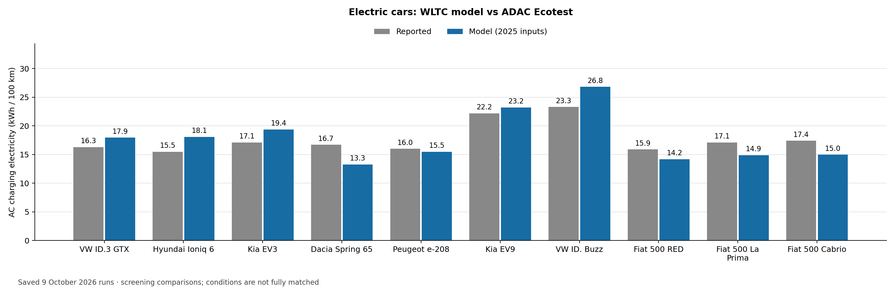
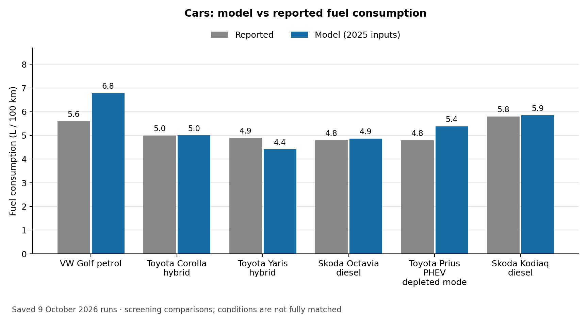
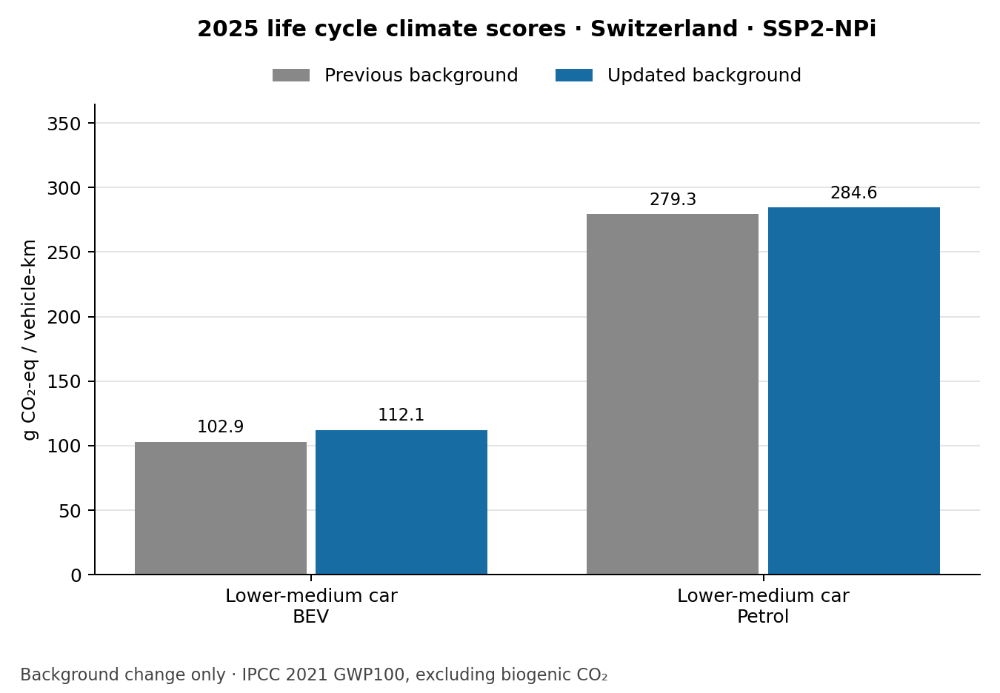

Validation examples: what the comparisons show
==============================================

A completed calculation is necessary but is not enough to establish that the
vehicle represents reality. This page separates comparisons with reported energy
use, checks of the calculation, and changes caused by the background database.
See :doc:`interpretation` for units and :doc:`validity` for detailed checks.

The figures reproduce **saved audits from October 2026**. This documentation
review replotted their recorded numbers; it did not rerun every model or fit
new parameters. Sources and software revisions belong to each audit, so these
figures should not be described as measurements of the latest software release.

How to make a fair energy comparison
------------------------------------

Match the vehicle and year, the second-by-second speed and road gradient, test
mass, resistance coefficients, temperature, auxiliary loads, and fuel or battery
properties. State where energy was measured. Charging electricity includes
losses that a battery-terminal measurement excludes. If a test mass is
reconstructed from curb mass and a documented payload, label it as reconstructed
rather than weighed.

The 9 October family evidence review retained 41 paired observations from 40
runs and excluded 77 other observations with recorded reasons. **All 41 pairs
remain screening comparisons under that review's strict matching rules.** This
is not a count of independently validated vehicles, and the earlier use of two
bus cycles to fit an auxiliary load does not change that classification.
Multiple cycles or meter locations on one vehicle share evidence.

Electric cars: a cycle mismatch matters
---------------------------------------

   Reported ADAC Ecotest charging electricity versus the model on WLTC, in
   kWh/100 km. The speed cycles differ. Where mass was missing, a documented
   200 kg test payload was added to reported curb mass; see the saved observation
   records for each case. Road load, auxiliaries and some vehicle years remain
   unmatched. :download:`Values <_static/validation/car_electricity.csv>`.

For example, the WLTC calculation gives 13.28 kWh/100 km for the Dacia Spring
comparison, against 16.70 reported by ADAC. That difference alone cannot identify
a battery or motor efficiency error because the tests use different cycles.

.. figure:: _static/validation/car_adac.png
   :alt: Mini electric-car consumption under WLTC and approximate ADAC traces, compared with reported values

   A separate experiment reconstructed the ADAC speed profile from a published
   graph and held the vehicle parameters fixed. These are approximate traces,
   not official numerical ADAC test files. The source graph has about 2.1 seconds
   per horizontal pixel, and sharp accelerations can exceed the generic motor
   rating. A smoother probe also changes the route and is not an equivalent test.

For the Spring, the graph-derived trace gives about 14.70 kWh/100 km, compared
with 13.28 on WLTC and 16.70 reported. For the Fiat 500 RED, the corresponding
values are 15.59, 14.19 and 15.90. The experiment shows sensitivity to the cycle;
it does not establish an exact reproduction of Ecotest or justify fitting a
component efficiency to the remaining difference.

See `the ADAC reconstruction guide <https://github.com/Laboratory-for-Energy-Systems-Analysis/carculator_utils/blob/master/docs/adac_cycle_comparison.rst>`_ for the four vehicles, 24 runs, reconstruction files and sources.

Petrol, diesel and hybrid cars
------------------------------

   Liquid-fuel comparisons from the same saved review, in L/100 km. ADAC Ecotest
   and the model's WLTC remain different. The Prius plug-in hybrid point is its
   depleted-battery mode, not a combined fuel-and-electricity result.
   :download:`Values <_static/validation/car_fuel.csv>`.

The Golf comparison gives 6.79 versus 5.60 L/100 km; the Corolla gives 5.00
versus 5.00. Neither a large difference nor close agreement isolates the engine
map from road load, cycle, auxiliary demand or hybrid control. The lower-medium
petrol diagnostics therefore examine physically justified inputs and optional
combustion controls rather than forcing a fixed error target; see `the petrol-car diagnostic guide <https://github.com/Laboratory-for-Energy-Systems-Analysis/carculator_utils/blob/master/docs/petrol_car_energy_diagnostics.rst>`_.

Change in life cycle climate scores
-----------------------------------

The next chart compares **two calculations**, not model outputs with measured
emissions. Both use the same 2025 vehicle inputs and national electricity-supply
settings in Switzerland. Only the bundled background inventory/index and impact
coefficients were changed. The updated bundle was rebuilt with premise and
ecoinvent 3.12 cutoff. The previous bundle is identified by Git revision
``aeace0e53937870fa05ec8aeba392e41d75aaa0b``; it should not be described as a clean
older-ecoinvent baseline because it already contained some newer coefficients.

The displayed scenario is ``SSP2-NPi``. Results are grams CO2-equivalent per
vehicle-km, using IPCC 2021 GWP100 excluding biogenic CO2 within the ``recipe``
midpoint collection. Vehicle masses and consumption were unchanged: all 138
recorded physical outputs matched exactly. The full audit covers 96 combinations
of eight vehicles, three years and four background scenarios.

   Model-to-model background comparison, not measured validation.
   :download:`Values <_static/validation/climate_car.csv>`.

Traceable results
-----------------

Download the :download:`plotted values and source checksums
<_static/validation/plot_inputs.json>` and :download:`source manifest
<_static/validation/source_manifest.json>`. The JSON stores observation IDs and,
where recorded in the comparison table, original source URLs. Sources for the
reused diagnostic figures are listed in their linked method pages.

The shared `background-rebuild guide <https://github.com/Laboratory-for-Energy-Systems-Analysis/carculator_utils/blob/master/docs/background_rebuild.rst>`_ contains the
complete climate CSV, software revisions, rebuild report and comparison command.
The `energy evidence guide <https://github.com/Laboratory-for-Energy-Systems-Analysis/carculator_utils/blob/master/docs/energy_measurements.rst>`_ provides the original
measurement catalog, exclusions and run records. These are reproducibility
records, not new evidence of external accuracy.

To redraw the new bar charts from saved results, run from ``carculator_utils``
with Matplotlib installed::

   python scripts/plot_documentation_validation.py --output /tmp/validation-plots

The plotting script does not recalculate vehicles. Reproducing a model audit
requires the matching source revisions and inputs recorded in that audit.
